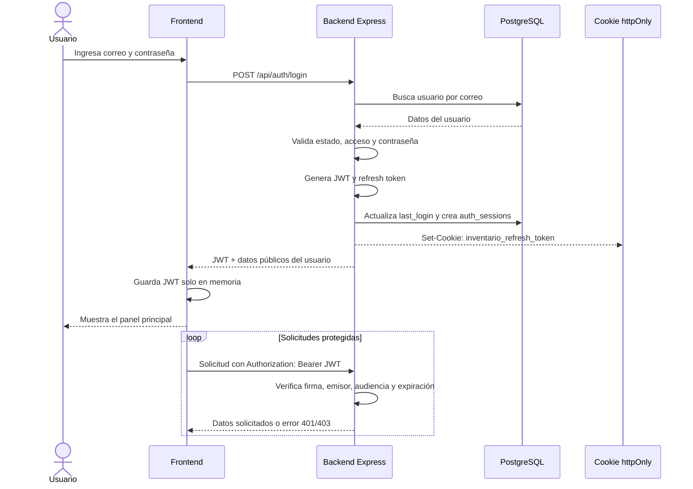

# Flujo de proceso de inicio de sesión

Este documento describe el proceso de autenticación del sistema de gestión de
inventario, desde que el usuario completa el formulario hasta que obtiene
acceso a los módulos protegidos.

## Componentes involucrados

- **Frontend:** React, componente `Login`, estado de autenticación y cliente
  Axios.
- **Backend:** Express, rutas `/api/auth`, controlador de autenticación y
  middleware `authenticateToken`.
- **Base de datos:** PostgreSQL, tablas `usuarios` y `auth_sessions`.
- **Tokens:**
  - **Access token:** JWT con una duración de 15 minutos.
  - **Refresh token:** valor aleatorio almacenado como hash en la base de
    datos y enviado al navegador mediante una cookie `httpOnly` con una
    duración de 7 días.

## Diagrama general



## 1. Carga inicial de la aplicación

Al montar la aplicación, el frontend intenta recuperar una sesión existente:

1. Ejecuta `POST /api/auth/refresh`.
2. El navegador envía automáticamente la cookie de refresh por
   `withCredentials: true`.
3. Si el refresh token es válido, el backend:
   - Busca su hash en `auth_sessions`.
   - Comprueba que no esté revocado ni vencido.
   - Comprueba que el usuario esté activo y tenga el acceso habilitado.
   - Genera un nuevo JWT de acceso.
   - Genera y almacena un nuevo refresh token, reemplazando el anterior.
   - Renueva la cookie.
4. El frontend guarda el JWT en memoria y establece el usuario actual.
5. Si no existe una sesión válida, se limpia el token y se muestra el
   formulario de inicio de sesión.

Mientras este proceso termina, la aplicación mantiene el estado de
autenticación en carga para evitar mostrar una vista incorrecta.

## 2. Envío del formulario

El usuario completa el correo electrónico y la contraseña en el componente
`Login`. El frontend envía:

```http
POST /api/auth/login
Content-Type: application/json

{
  "email": "usuario@tc.pe",
  "password": "********"
}
```

El endpoint está protegido por un limitador de intentos: permite como máximo
5 solicitudes en una ventana de 15 minutos.

## 3. Validaciones del backend

El backend procesa la solicitud en este orden:

1. Recorta espacios del correo y comprueba que correo y contraseña estén
   presentes.
2. Busca el usuario sin distinguir mayúsculas y minúsculas en el correo.
3. Rechaza la solicitud si el usuario no existe.
4. Rechaza el acceso si:
   - No existe una contraseña configurada.
   - `activo_login` es `false`.
   - `estado` es `inactivo`.
5. Compara la contraseña recibida con el hash almacenado mediante bcrypt.
6. Si la contraseña no coincide, devuelve un error de credenciales inválidas.

Las respuestas principales son:

| Código | Situación | Respuesta |
|---|---|---|
| `200` | Credenciales válidas | JWT y usuario seguro |
| `400` | Faltan correo o contraseña | `Email y contraseña son obligatorios` |
| `401` | Usuario inexistente o contraseña incorrecta | `Credenciales inválidas` |
| `403` | Usuario bloqueado o inactivo | `Usuario sin acceso habilitado` |
| `429` | Se superó el límite de intentos | `Demasiados intentos. Intenta de nuevo más tarde.` |
| `500` | Error inesperado del servidor | Error interno de autenticación |

## 4. Creación de la sesión

Cuando las credenciales son correctas, el backend:

1. Genera un JWT de acceso con:
   - Identificador del usuario (`sub`).
   - Correo electrónico.
   - Rol.
   - Nombre.
   - Tipo `access`.
   - Emisor `inventario-bienes`.
   - Audiencia `inventario-web`.
   - Expiración de 15 minutos.
2. Genera un refresh token aleatorio.
3. Calcula el hash SHA-256 del refresh token. Solo este hash se almacena en
   `auth_sessions`; el valor original no se guarda en la base de datos.
4. Actualiza `usuarios.last_login`.
5. Crea una sesión con fecha de expiración a 7 días.
6. Envía el refresh token en la cookie
   `inventario_refresh_token`.
7. Devuelve el JWT y los datos públicos del usuario:

```json
{
  "token": "<access-token>",
  "user": {
    "id": 1,
    "nombre": "Nombre del usuario",
    "email": "usuario@tc.pe",
    "departamento": "Tecnología de la Información",
    "rol": "administrador",
    "estado": "activo",
    "activo_login": true,
    "last_login": "2026-09-23T23:30:00.000Z"
  }
}
```

La contraseña, `password_hash` y el refresh token nunca se incluyen en la
respuesta.

## 5. Estado de autenticación en el frontend

Después de una respuesta exitosa:

1. El frontend registra el JWT en memoria mediante `setAuthToken`.
2. Axios agrega el encabezado a las solicitudes posteriores:

```http
Authorization: Bearer <access-token>
```

3. Se establece el usuario actual.
4. Se muestra el dashboard.
5. Se cargan los bienes y, si el rol lo permite, los usuarios.

El JWT no se persiste en `localStorage` ni en `sessionStorage`. Al recargar la
página, la sesión se recupera mediante la cookie de refresh.

## 6. Acceso a rutas protegidas

Las rutas protegidas utilizan el middleware `authenticateToken`, que:

1. Lee el encabezado `Authorization`.
2. Comprueba que use el esquema `Bearer`.
3. Verifica la firma, expiración, emisor, audiencia y tipo del JWT.
4. Coloca la información del usuario en `req.user`.
5. Permite continuar con la solicitud.

Si el token falta, es inválido o expiró, se devuelve `401`. Las rutas que
requieren permisos adicionales también validan el rol y devuelven `403` si el
usuario no está autorizado.

## 7. Renovación automática del token

Cuando una solicitud protegida responde `401`, el interceptor de Axios:

1. Evita reintentar la misma solicitud más de una vez.
2. Ejecuta `POST /api/auth/refresh`, excepto para los propios endpoints de
   autenticación.
3. Recibe un nuevo JWT y actualiza el token en memoria.
4. Reintenta la solicitud original con el nuevo JWT.
5. Si la renovación falla, limpia el token y propaga el error para que la
   aplicación vuelva al estado no autenticado.

Las solicitudes concurrentes comparten la misma promesa de renovación para
evitar crear varias sesiones de refresh al mismo tiempo.

## 8. Cierre de sesión

Al cerrar sesión, el frontend ejecuta:

```http
POST /api/auth/logout
```

El backend:

1. Busca el refresh token presente en la cookie.
2. Calcula su hash.
3. Marca la sesión correspondiente como revocada mediante `revoked_at`.
4. Elimina la cookie del navegador.

El frontend limpia el JWT en memoria, el usuario actual, los datos cargados y
regresa a la pantalla de inicio de sesión.

## Endpoints relacionados

| Método | Endpoint | Autenticación | Uso |
|---|---|---|---|
| `POST` | `/api/auth/login` | No | Validar credenciales y crear sesión |
| `POST` | `/api/auth/refresh` | Cookie de refresh | Renovar JWT y rotar refresh token |
| `GET` | `/api/auth/me` | JWT Bearer | Consultar el usuario autenticado |
| `POST` | `/api/auth/logout` | Cookie de refresh | Revocar la sesión y eliminar cookie |

## Consideraciones de seguridad

- Las contraseñas se almacenan como hashes bcrypt.
- El refresh token se almacena como hash SHA-256 en la base de datos.
- La cookie de refresh es `httpOnly`, por lo que no es accesible desde
  JavaScript.
- En producción, la cookie usa `secure` y `sameSite: none`.
- Los tokens de acceso tienen una vida corta.
- Los refresh tokens se rotan durante cada renovación.
- El endpoint de login limita los intentos repetidos.
- Las respuestas de usuario se filtran mediante un objeto seguro y no exponen
  información sensible.
